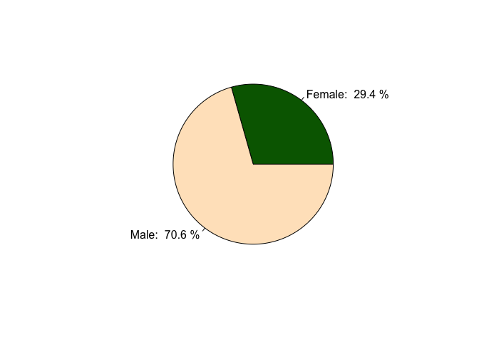
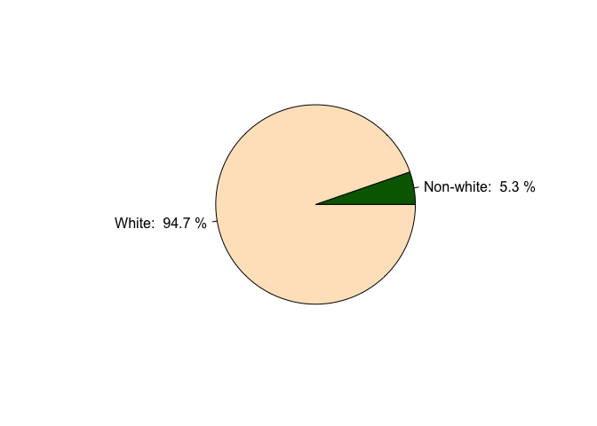
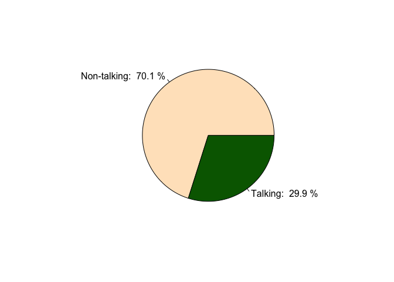

# The New Yorker Cartoons 2014: a gentle examination of cartoon characters by gender and ethnicity
Suzanne Hartley  
October 4, 2015  
## Introduction

While browsing reddit.com for interesting data to play with, I came across this
[dataset on all the cartoons of The New Yorker published in 2014](http://www.reddit.com/r/datasets/comments/36w9vc/dataset_on_all_the_cartoons_of_the_new_yorker/). Follow the link for a description of how the dataset was compiled, some analyses of that
data (answering questions not addressed here), as well as the source data itself.

The dataset includes the following fields for each of the 1810 human cartoon
characters portrayed:

* Issue # (in which cartoon appears)
* Date (of publication)
* Page (on which cartoon appears)
* Ethnicity (of character portrayed)
* Gender (of character portrayed)
* Occupation (of character portrayed)
* Cartoonist (author of cartoon)
* Talk (indicates if character has talking part)
* Notes

The focus of this exercise is on gender and ethnicity of cartoon characters,
who does what, and who gets to talk.

A few caveats regarding myself as an investigator:

* I have not seen any of the cartoons under study
* Although I occasionally listen to The New Yorker Fiction Podcast, and for a
while followed @TheNewYorker on Twitter, I have hardly ever read a print
copy of The New Yorker
* I **DO** have a background in data analysis and statistics — but have kept
this ridiculously simple (just a couple of Chi-Square tests)
* I **DO NOT** have a formal background in social science
* I **DO** have a sense of humor
* This report is presented for entertainment purposes only. Any serious
insights gleaned are coincidental and unintentional.

<br>
This is what the data look like:

```
##   Issue   Date Page Ethnicity Gender Occupation Cartoonist Talk. Notes
## 1     1 1/6/14   20         w      f     spouse      Kanin    no      
## 2     1 1/6/14   20         w      m     spouse      Kanin   yes      
## 3     1 1/6/14   25         w      m     police      Dator   yes      
## 4     1 1/6/14   25         w      m     person      Dator    no      
## 5     1 1/6/14   26         w      f     person      Chast    no      
## 6     1 1/6/14   26         w      f     person      Chast    no
```
<br><br>

## First, a couple of pie charts!
OK. Pie charts are not the best way to visualize data — but when the pie is
only being split two ways, it’s not unreasonable.


```r
props <- prop.table(table(indata$Gender))
props <- round(100*props,1)
pielabels <- c(paste("Female: ",props[1],"%"),paste("Male: ",props[2],"%"))
pie(props,labels=pielabels,col=c("darkgreen","bisque"))
```

 

```r
props <- prop.table(table(indata$Ethnicity))
props <- round(100*props,1)
pielabels <- c(paste("Non-white: ",props[1],"%"),paste("White: ",props[2],"%"))
pie(props,labels=pielabels,col=c("darkgreen","bisque"))
```

 
<br>

Clearly, females and nonwhites are under-represented in The New Yorker
cartoons. Now let’s see what kind of characters are portrayed by
combinations of gender and race.

<br>

## Occupation by gender and ethnicity

(Note: there were no characters that were exclusively female or exclusively nonwhite.)


```r
require(reshape2)
people <- indata[,4:6]
occupations <- dcast(melt(people), Occupation ~ Ethnicity + Gender)
names(occupations) <- c("Character", "Nonwhite_Female","Nonwhite_Male", "White_Female", "White_Male")
```
<br><br>

#### White males only


```
##        Character Nonwhite_Female Nonwhite_Male White_Female White_Male
## 7       castaway               0             0            0          7
## 10 coach/trainer               0             0            0          7
## 11        cowboy               0             0            0         20
## 15     defendant               0             0            0          2
## 21           god               0             0            0          6
## 31       mobster               0             0            0         23
## 41      prisoner               0             0            0         10
## 44       soldier               0             0            0         44
## 47     superhero               0             0            0          7
```
The most exclusive preserve of the white male would be the role of soldier
(which is actually the one that most surprises me), followed by mobster and
cowboy. Without having seen the cartoons, I would assume the 6 depictions of god
refer to the monotheistic god with a big “G”, as in God, as opposed to a
generic god with a small “g” who could indeed be nonwhite and even sport
multiple arms.  
<br><br>

#### Males only


```
##          Character Nonwhite_Female Nonwhite_Male White_Female White_Male
## 4  baseball player               0             1            0          8
## 32     monk/priest               0             2            0          6
## 38          police               0             1            0         27
## 40    prison guard               0             1            0         10
```
No big surprises here.  
<br><br>

#### Whites only


```
##           Character Nonwhite_Female Nonwhite_Male White_Female White_Male
## 6              boss               0             0            2         15
## 8       cave person               0             0           12         31
## 19    food preparer               0             0            1          9
## 20      food server               0             0            8         13
## 22           golfer               0             0            1          6
## 24       journalist               0             0            3          5
## 25            judge               0             0            3          6
## 36          patient               0             0            3         18
## 42 religious figure               0             0            4         29
## 48          teacher               0             0            3          6
## 50    wedding party               0             0            4          5
```

The most interesting finding would be the exclusive whiteness of cave
persons. It’s also a pretty hilarious finding when you think about it. Can’t say
the same with regard to religious figures.  
<br><br><br>

#### Nonwhite males excluded


```
##    Character Nonwhite_Female Nonwhite_Male White_Female White_Male
## 49 therapist               1             0            1         13
```

I’m amazed there’s only one!  
<br><br>

#### Nonwhite females excluded


```
##                Character Nonwhite_Female Nonwhite_Male White_Female White_Male
## 1                  angel               0             3            5         11
## 2              assistant               0             1            4          2
## 3        athlete (other)               0             1            3         24
## 5     blue collar worker               0             1            1          9
## 12              criminal               0             2            1         18
## 16           entertainer               0             1            9         21
## 17        fantasy figure               0             3            4          5
## 18           firefighter               0             1            1          5
## 23 historical stereotype               0             2            2         24
## 27                lawyer               0             1            2         16
## 28       literary figure               0             1            2          8
## 30  medieval/royal court               0             2            1         25
## 34                parent               0             1           44         27
## 39            politician               0             1            3         23
## 43             scientist               0             1            1         14
## 46               student               0             5           20         16
```

Nonwhite women, on the other hand, are shut out from many roles — both
everyday (parent, student) and fantastical (angel, fantasy figure, medieval/
royal court). And even if there is a non-white god with multiple arms amongst the fantasy
figures, it will be male.  
<br><br>

#### All inclusive


```
##           Character Nonwhite_Female Nonwhite_Male White_Female White_Male
## 9             child               2             3           38         54
## 13            crowd               1             3           14         19
## 14 customer service               1             3           13         33
## 26    juror/witness               1             1            1          7
## 29          medical               1             5            4         19
## 33    office worker               3             6           29        120
## 35       party goer               6             6           38         48
## 37           person               6             9          111        216
## 45           spouse               3             3          112        109
```

It would appear that diversity in cartoons is favored by the generic as
opposed to the specific — such as married office workers with families who
sometimes attend parties.  
<br><br>


## So, who's doing the talking?

 
  
#### Gender comparison


```r
males <- subset(indata,Gender=="m")
females <- subset(indata, Gender=="f")
talk <- as.table(rbind(summary(males$Talk.),summary(females$Talk.)))
rownames(talk) <- c("male","female")
talk
```

```
##         no yes
## male   903 374
## female 365 168
```

```r
summary(talk)
```

```
## Number of cases in table: 1810 
## Number of factors: 2 
## Test for independence of all factors:
## 	Chisq = 0.8933, df = 1, p-value = 0.3446
```
The p-value of the Chi-square statistic suggests that although females are
under-represented, the female characters that are portrayed are no less
likely to having talking parts than males.  
<br><br>

#### Ethnicity comparison


```r
whites <- subset(indata,Ethnicity=="w")
nonwhites <- subset(indata,Ethnicity=="nw")
talk <- as.table(rbind(summary(whites$Talk.),summary(nonwhites$Talk.)))
rownames(talk) <- c("white","nonwhite")
talk
```

```
##            no  yes
## white    1188  526
## nonwhite   80   16
```

```r
summary(talk)
```

```
## Number of cases in table: 1810 
## Number of factors: 2 
## Test for independence of all factors:
## 	Chisq = 8.52, df = 1, p-value = 0.003512
```
However, nonwhite characters are significantly less likely to have talking
parts than whites.  


<br><br>

#### Most talkative by occupation


```
##        Occupation talk all percent
## 20    food server   13  21      62
## 6            boss   10  17      59
## 10  coach/trainer    4   7      57
## 29        medical   16  29      55
## 38         police   15  28      54
## 17 fantasy figure    6  12      50
## 16    entertainer   13  31      42
## 11         cowboy    8  20      40
## 41       prisoner    4  10      40
## 49      therapist    6  15      40
```
I have a headache at the very sight of that list!  
<br><br>

#### Least talkative by occupation


```
##       Occupation talk all percent
## 15     defendant    0   2       0
## 24    journalist    0   8       0
## 26 juror/witness    0  10       0
## 13         crowd    1  37       3
## 35    party goer   11  98      11
## 2      assistant    1   7      14
## 7       castaway    1   7      14
## 18   firefighter    1   7      14
## 9          child   16  97      16
## 21           god    1   6      17
```
Now that could make for an interesting party…….a good idea to close with.
